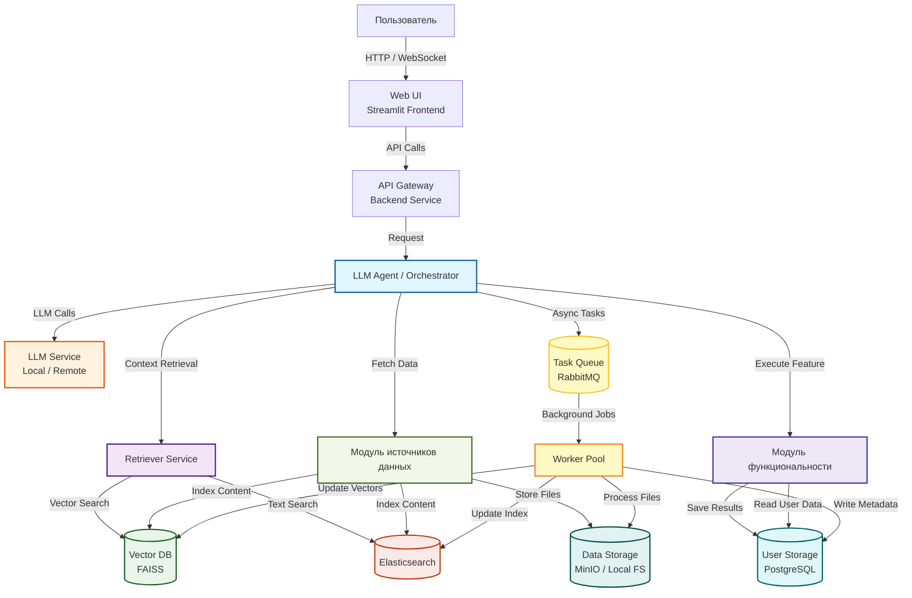

# Идея проекта

>[!note] Идея
>А если сделать своего LLM-Ассистента для помощи в обучении в течении всей жизни?

Интегрирующего проекты [Обзор проектов](../docs/06-ideas/projects-overview.md) в единое целое?

## 🎯 **Цель проекта**

Создать персонализированного, локально развернутого ИИ-ассистента, который:

- Помогает специалисту в области Deep Learning **непрерывно учиться** (lifelong learning),
- Интегрирует **внешние источники** (новости, учебники, статьи) и **внутренние знания** (заметки в Obsidian),
- Адаптирует объяснения под текущий уровень понимания,
- Поддерживает подготовку к собеседованиям и углубление в темы через контекстуальные ссылки.

## 🧠 **Ключевые компоненты**

| Компонент                    | Источник                                                  | Функция в единой системе                                                                                                 |
| ---------------------------- | --------------------------------------------------------- | ------------------------------------------------------------------------------------------------------------------------ |
| **Новостной модуль**         | Telegram-каналы (через API)                               | Слежение за свежими трендами в DL/ML, автоматическая индексация и ответы с цитированием источников.                      |
| **Личная база знаний**       | Obsidian (Markdown + граф заметок)                        | Извлечение персонального контекста: "Что я уже знаю по этой теме?", "Как я это понимал раньше?"                          |
| **Учебный модуль**           | Учебники (Яндекс ML, книги, статьи)                       | Глубокое объяснение тем с адаптацией под уровень.                                                                        |
| **Репетиторский агент**      | Комбинация учебных материалов + модель понимания уровня   | Динамическое упрощение/усложнение объяснений на основе истории взаимодействия.                                           |
| **Собеседовательный модуль** | Конспекты, документация, LeetCode/ML-вопросы              | Подготовка к интервью: "Объясни Transformer так, будто я junior", "Как бы ты ответил на этот вопрос на интервью в Meta?" |
| **Книжный RAG**              | Выбранные книги (например, "Deep Learning" by Goodfellow) | Детальные ответы с указанием глав/страниц — полезно для академического погружения.                                       |

---

## 🧪 Примеры использования

1. **"Что нового в LLM за последнюю неделю?"**  
   → Ассистент ищет в Telegram-каналах, возвращает 3 ключевые новости с цитатами и ссылками.

2. **"Объясни мне attention mechanism, как будто я только начал учиться"**  
   → Использует учебник Яндекса + книгу Goodfellow, упрощает ответ, ссылается на главы.

3. **"Как я понимал attention в своих заметках?"**  
   → Ищет в Obsidian, показывает твои прошлые записи + предлагает обновить их с учётом новых знаний.

4. **"Как ответить на вопрос 'Расскажи про fine-tuning LLM' на собеседовании в стартап?"**  
   → Даёт структурированный ответ (определение → методы → примеры → pitfalls), ссылается на документацию и твои конспекты.

5. **"Сравни моё понимание diffusion models с тем, что написано в учебнике"**  
   → Сопоставляет твои заметки и официальный источник, выделяет расхождения/дополнения.

---

## 🛠️ Технические детали

- **Frontend**: Streamlit (основной), Telegram-бот (альтернатива).
- **Backend**: FastAPI или LangChain/LlamaIndex для оркестрации.
- **Хранилище**: Chroma / FAISS / Qdrant (локально) с раздельными коллекциями под каждый источник.
- **Модель**: локальная (Ollama, LM Studio, vLLM) — приватность и offline-режим.
- **Обработка Obsidian**: парсинг `.md` файлов, извлечение связей (можно использовать `obsidian-export` или `dataview` API).

## 🧠 **Lifelong Learning Assistant для Deep Learning специалиста**

**Lifelong Learning Assistant** — это интеллектуальный ассистент для специалистов в области Deep Learning, которые стремятся к непрерывному профессиональному росту.

Система объединяет:
- базу знаний пользователя (Obsidian) и лучшие практики для обучения
- внешние учебные материалы (Учебники/Книги/Статьи)
- новости из выбранных tg-каналов

Система помогает:
- вести персональную Базу знаний и поддерживать ее в актуальном состоянии
- готовится к собеседованиям
- отслеживать новости в области интереса пользователя по выбранным им tg каналам
- искать ответы основываясь на выбранных пользователем книгах / учебниках / статьях

Это модульный амбициозный проект, который состоит из проектов предложенных командой курса, - **Knowledge Assistant**, **Ассистент для подготовки к собеседованиям**, **AI репетитор**,  **News Assistant AI** , **Поисковик по учебнику Яндекса по ML**, **Book RAG**, но объединенных вместе.

К концу курса планируется реализовать MVP проекта, реализующего 1-2 компонента(проекта) из выше причисленных.

## 💡 Уникальное преимущество

Это не просто ещё один RAG-чат, а **интеллектуальный компаньон для профессионального роста**, который:
- знает **твои знания** (через Obsidian),
- знает **глобальные знания** (учебники, новости),
- умеет **объяснять**, **готовить к собеседованиям**
- **отслеживать тренды** — всё в одном месте.

В итоге делаем систему которая базируется на Обсидиан, помогает не забывать ключевые идеи по алгоритмам интервального повторения, автоматически генерирует квизы, карточки и т.д. для активного воспроизведения и т.д.

Ассистент который поможет подготовится к классической схеме:
1. алгоритмы
2. классик МЛ
3. спец область CV / NLP =)

Можно в теории потом open source проект сделать и еще вся мага по нему будет готовится к собесам потом)
Или может быть сделать как спец ПО от нашей маги для ее студентов)
Или с каким-нибудь Яндекс.Практикумом интегрировать!
Дмитрий Ботов очень поддерживает проекты по ИИ для обучения)

# Описание проекта (краткое)

🧠 **Lifelong Learning Assistant** для Deep Learning специалиста

AI-ассистент для специалистов в области Deep Learning, которые стремятся к непрерывному профессиональному росту.

**Система объединяет:**
- базу знаний пользователя (Obsidian) и лучшие практики для обучения
- внешние учебные материалы (Учебники/Книги/Статьи)
- новости из выбранных tg-каналов

**Система помогает:**
- вести персональную Базу знаний и поддерживать ее в актуальном состоянии
- готовится к собеседованиям
- отслеживать новости в области интереса пользователя по выбранным им tg каналам
- искать ответы основываясь на выбранных пользователем книгах / учебниках / статьях

Это модульный амбициозный проект, который состоит из проектов предложенных командой курса:
- Knowledge Assistant
- Ассистент для подготовки к собеседованиям
- AI репетитор
- News Assistant AI
- Поисковик по учебнику Яндекса по ML
- Book RAG

но объединенных вместе общей целью, - сделать Ассистента для непрерывного личного профессионального развития.

К концу курса планируется реализовать MVP проекта, реализующего **1-2 компонента(проекта)** из выше причисленных.

# Видение проекта

У нас есть LLM-агент помогающий в обучении.
У него есть инструменты дающие ему следующие возможности:
- работа над заметками(файлами markdown) из хранилища Obsidian пользователя
Редактирование, создание опр. типов карточек, помощь в ведении карточек и т.д.
Например, создание карточек для интервального повторения.
Помощь в создании тематических карточек в обсидиан (cheatshit для конкретной темы).

- есть скачанный Учебник Яндекса по МЛ.
Ассистент может отвечать на вопросы пользователя по МЛ на его основе.

- есть возможность добавить в базу книгу в формате fb2 и других текстовых форматах, чтобы агент мог отвечать опираясь на текст книги.
- есть возможность ходить в Интернет и осуществлять поиск в нем например с помощью tavily search
Для проверки актуальности и корректности информации через интернет.
- есть возможность указать список telegramm каналов.

Агент по запросу пользователя будет считывать новые сообщения из этих каналов, и учитывая интересны пользователя, показывать ему только те сообщения которые ему интересны.
Предлагать создать карточку для obsidian из понравившихся сообщений.
Список каналов задается пользователем и может редактироваться.
Нужно в целом как то категорировать контент (возможно тегами).
Анализ новостей и трендов  из тг каналов и выделение тем интересных пользователю.

- **Одна из главных функции ИИ ассистента, создавать квизы по материалам.**
Проводить тестирование пользователя.
Это как карточки интервального повторения только вопросы в них могут динамически меняться чтобы пользователь не выучивал наизусть ответы, а каждый раз отвечал по выбранным темам как в первый - задействуем технику активного воспроизведения.

- **Еще одна функция, - это симуляция собеседований.**
МООК-собеседование, его симуляция, обратная связь по ответам пользователя.

- Объяснение материала с опорой на Источник (Obsidian / Учебник Яндекса / Книгу / Интернет) со ссылками на источники.

По будет представлять собой набор docker-контейнеров разворачиваемых на пк пользователя.
У него должен быть Web-UI интерфейс, который будет открывать в браузере пользователя.
Это сделано для переносимости и легкого кросс-платформенного запуск ПО.

# Архитектура ПО

### 1. Пользователь и интерфейс

Пользователь взаимодействует **только через Web UI (Streamlit)**, который вызывает API Gateway.
### 2. API Gateway

Реализует авторизацию, маршрутизацию запросов и передачу сложных запросов в **LLM Orchestrator**.
### 3. LLM Agent

Функционал:
- решает, какие адаптеры источников и функциональные модули подключить;
- запрашивает контекст у Retriever;
- вызывает LLM;
- координирует сохранение данных и создание фоновых задач.
### 4. Retriever Service

Функционал:
- векторный (FAISS) поиск
- текстовый (Elasticsearch) поиск
- возвращая релевантные фрагменты и метаданные.
### 5. Абстрактный Модуль Источников

Унифицированный слой доступа к данным:
- долговременные источники (Obsidian, Books, Yandex);
- внешние одноразовые (Telegram, Internet via Tavily, Docs via Context7).

Каждый адаптер может сохранять, индексировать или просто передавать данные в Orchestrator.

### 6. Абстрактный Модуль Функционала

Набор интеллектуальных инструментов:
- **Quiz Engine** — генерирует и адаптирует тесты;
- **Interview Simulator** — симулятор собеседований.

Оба используют результаты Retriever и LLM для своей логики.

### 7. Асинхронность

Модуль для выполнения тяжелых фоновых задач
- RabbitMQ ставит задачи в очередь (парсинг, эмбеддинги, индексирование).  
- Worker Pool (Celery или аналоги) выполняет их и обновляет хранилища.
### 8. Хранилища

- **Postgres (User Storage)** — метаданные, результаты квизов, настройки.
- **MinIO / Local FS (Data Storage)** — файлы и снапшоты.
- **FAISS (Vector DB)** — эмбеддинги.
- **Elasticsearch (Semantic Search)** — текстовый индекс.

## Краткое резюме архитектуры

- Пользователь работает только через Web UI/Streamlit.
- Запросы идут на API Gateway → Orchestrator (AG — LLM Agent), который по контексту решает, какие инструменты использовать:
1. Retriever Service (для поиска инфы из локальных источников)
2. LLM (для генерации текста)
3. Quiz/Interview engines
4. Tavily (веб-поиск).

Для тяжёлых задач:
- очередь задач (Redis/RabbitMQ)
- пул воркеров.

Данные хранятся:
- в Postgres (метаданные)
- локальном FS (сырые файлы, snapshots)
- векторной БД (FAISS)
- Elasticsearch (полнотекстовый индекс). 
- Все тяжёлые преобразования — идут фоновыми операциями через воркеры; UI остаётся отзывчивым.

# Компоненты (что делает каждый)

### Внешний интерфейс

**Web UI** — интерфейс с которым взаимодействует пользователь. Единая точка входа.

**Функционал:**
- настройки пользователя (например список предпочитаемых тем)
- настройки источников
- запуск квизов
- просмотр результатов
- работа с Obsidian
- загрузка книг/статей
- управление каналами Telegram
### Сервисный слой

- **API Gateway Backend Service** — принимает запросы от UI, проверяет аутентификацию и авторизацию, выполняет быстрые CRUD-операции (пользователи, конфиги), диспетчеризует запросы к Orchestrator, ставит тяжелые задачи в очередь. Отвечает клиенту синхронно, либо возвращает task-id для асинхронных операций.
- **Auth & Policy** — локальные учётки / API-токены.

# Ассистент

## LLM Agent / Orchestrator

**Функционал:** 
- принимает запрос пользователя (например «сгенерируй квиз по главе 4 учебника» или «ответь на вопрос»)
- решает, какие инструменты использовать и в каком порядке
- формирует контекст (из Retrivier и/или веб-поиска)
- формирует prompt
- вызывает LLM через LLM Connector
- обрабатывает ответ (фильтрация, нормализация, создание карточек).
- Orchestrator это Агент к которому подключены наборы инструментов (obsidian-tool, yandex-tool, tavily-tool, quiz-tool и т.д.).

## LLM Service
адаптер для вызова LLM (локальная модель или облачный провайдер). 
Выделен, чтобы менять модель без рефакторинга остальной логики.
Поддерживает управление контекстом, temp/temperature, токен-лимиты, cost control.

## Retriever Service
отвечает за извлечение релевантного контекста: 
- комбинирует результаты векторного поиска (Vector DB)
- текстового поиска (Elasticsearch). 

Возвращает выдержки/фрагменты с указанием источников и метаданных (файл, глава, позиция).

### Embedding Service
сервис, который превращает текст в векторы; 
- можно менять модель эмбеддингов. 

Используется отдельно, чтобы при смене эмбеддингов не трогать RAG/Orchestrator.

### Vector DB
хранит эмбеддинги и обеспечивает быстрый семантический поиск (FAISS).
### Elasticsearch
полнотекстовый индекс, для точного поиска по главам, заголовкам.

### Абстрактный модуль для работы с источниками

#### Для долговременного хранения в индексах

Индексируем и храним в базах для работы.
##### Obsidian Adapter
синхронизирует папку Obsidian: читает markdown, извлекает метаданные (frontmatter, связки, теги), превращает в документы для индексации и базу карточек.
##### Books Adapter 
парсер форматов (fb2, epub, txt): извлекает текст, главы, метаданные; кладёт сырьё в FS и ставит задачу на обработку (создание эмбеддингов, индексирование в ES).
##### Yandex Handbook Adapter
специализированный парсер учебника Яндекса по ML: выделяет структуру (глава/подглава/пример), создаёт ссылки на точные места в тексте для цитирования.

#### Для единоразового поиска

Обычно добываем информацию, отвечаем пользователю.
Если пользователь хочет. то может сохранить найденную инфу в долговременную базу, например в карточку для Obsidian.
###### Telegram Adapter
по расписанию или webhook читает сообщения из каналов (user-configured), фильтрует шум, тэгирует, сохраняет полезный контент в FS/PG и индексирует. Это фон — не UI. Можно отключить.
###### Internet Adapter
Tavily Web Search (WEB)
внешний интернет-коннектор: LLM Orchestrator при необходимости вызывает Tavily, получает релевантные результаты (URL, snippet). Сохраняет raw snapshots в FS и ставит задачи для обработки (извлечение текста, эмбеддинги, индекс).
###### Docs Adapter
Context7
внешний интернет-коннектор: LLM Orchestrator при необходимости вызывает Tavily, получает релевантные результаты (URL, snippet). Сохраняет raw snapshots в FS и ставит задачи для обработки (извлечение текста, эмбеддинги, индекс).

## Функциональные модули

##### Quiz Engine
генерирует вопросы (MCQ, open, code snippets), умеет: формировать варианты, уровни сложности, адаптировать вопросы по ошибкам пользователя, интегрировать с Scheduler для интервального повторения. Сохраняет метрики (успех/провал) в Postgres и использует их для настройки будущих сессий.
##### Interview Simulator
сценарии собеседований: ролевая игра (вопросы, follow-ups), запись ответов пользователя (аудио/текст), автооценка по метрикам и ручная обратная связь от преподавателя.
## Асинхронность и обработка

##### Task Queue (RabbitMQ)
Любые длительные задачи (парсинг книг, создание эмбеддингов, обработка веб-snapshots, массовая реиндексация) ставятся в очередь.

##### Worker Pool
Воркеры читают задачи и выполняют: 
- парсинг, извлечение текста из HTML
- генерацию эмбеддингов
- запись в Vector DB/Elasticsearch, очистку и нормализацию, создание карточек, бэкапы.
## Хранилища

#### User Storage
(Postgress)
- пользователи, конфиги, метаданные, результаты квизов, логика spaced repetition (карточки, интервалы).

#### Data Storage
(Local FS (FS) / MinIO)
- сырые файлы: загруженные книги, snapshots web, экспорты Obsidian, аудиозаписи собеседований.

#### Vector DB
(FAISS)
- эмбеддинги

#### Semantic Search
(Elasticsearch)
- полнотекстовая индексация.

## Инфраструктура наблюдаемости и развёртывания

- Логи → ELK/Loki; метрики → Prometheus/Grafana; CI/CD для тестов и сборки контейнеров.
- Деплой: docker-compose (локально). Регулярные бэкапы PG и VDB snapshots.

Основные сценарии использования (пошагово)
1) Быстрый Q&A (пользователь задаёт вопрос)

UI → API: отправляется запрос с вопросом и контекстом (опционально — выбранный источник: учебник, Obsidian).

API авторизует, передаёт Orchestrator.

Orchestrator:

вызывает RAG (VDB + ES) для извлечения релевантных фрагментов.

при необходимости вызывает Tavily (WEB) для свежих данных.

агрегирует контекст (прилагает ссылки/фрагменты и приоритеты).

формирует prompt и вызывает LLM через LLM Connector.

LLM возвращает ответ; Orchestrator форматирует ответ, добавляет источники и confidence/метаданные.

Ответ возвращается в UI; при необходимости создаётся фоновая задача: если найдено новое релевантное внешнее содержимое — Worker ставит задачу на индексацию.

2) Генерация квиза по главе учебника

UI → API: «Сгенерируй 10 вопросов по главе X».

API → AG: Orchestrator запрашивает контент через RAG (Yandex Indexer + VDB/ES).

AG вызывает Quiz Engine с контекстом; Quiz Engine генерирует вопросы/варианты.

Quiz создаётся и сохраняется в Postgres; пользователь получает интерфейс прохождения.

Результаты прохождения сохраняются; Scheduler может пересчитать интервалы для карточек.

3) Загрузка книги (fb2/epub/txt)

UI → API: загружаем файл.

API сохраняет сырой файл в FS и ставит задачу в LQ.

Worker парсит файл: извлекает главы, метаданные; вызывает Embedding Service для chunk’ов; записывает эмбеддинги в VDB и тексты в ES; сохраняет маппинг в Postgres.

По завершении — уведомление в UI.

4) Запрос с проверкой фактов в вебе (Tavily)

При необходимости Orchestrator вызывает Tavily с поисковым запросом.

Tavily возвращает список результатов; Orchestrator включает лучшие фрагменты в контекст LLM.

Результаты сохраняются в FS (snapshots) и ставятся в очередь на индексацию (если политика хранения позволяет).

После индексации веб-контент становится доступен для будущих RAG-запросов.

5) Фоновый сбор телеграм-каналов

Telegram Ingestor по расписанию читает новые сообщения выбранных каналов.

Сохраняет сообщения в FS/PG, прогоняет Tagger/Topic Modeling.

Релевантные сообщения получают превью/рейтинг; пользователю предлагается (в UI) превью и опция создать карточку в Obsidian.

Происхождение и прозрачность ответа (provenance)

Для каждого ответа система возвращает набор источников: файл/глава, URL snapshot, позиция в Obsidian.

Orchestrator сохраняет trace (что было вызвано: RAG snippets, Tavily hits, prompt): это позволяет воспроизводить и проверять ответы.

### Политики хранения, конфиденциальности и безопасность

По умолчанию — локальное хранение (MinIO / локальная FS). Можно добавить шифрование at-rest для чувствительных файлов.

Пользователь управляет retention для веб-snapshots и загруженных книг.

Аутентификация: локальные пароли/токены + опция 2FA. Роль-базированный доступ к экспортам и админ-функциям.

Надёжность, масштабирование и восстановление

Масштабирование: горизонтально масштабируются воркеры и компоненты RAG (VDB sharding / weaviate cluster), Elasticsearch — shard/replica. LLM Connector масштабируется при использовании облачных провайдеров; для локальных моделей — привязка к ресурсов машины.

Резервное копирование: регулярные snapshot’ы Postgres и VDB; экспорт MinIO (s3 sync).

Отказоустойчивость: retry для очередей, circuit breaker для LLM/Tavily, graceful degradation (если внешний поиск недоступен, система использует только локальные источники).

Мониторинг и операционная поддержка

Метрики: latency API, task queue length, worker failures, LLM token usage, index freshness.

Логи запросов и трассировки Orchestrator для отладки сложных ответов.

Alerts на переполнение очередей, падение воркеров, превышение квот внешних запросов.

Точки расширения (как добавлять новый функционал)

Плагины-инструменты для Orchestrator: создать новый инструмент с контрактом (метод run(context)) — Orchestrator динамически загружает его.

Новые форматы контента: добавить парсер в Book Ingest → сохранить в FS → поставить задачу генерации эмбеддингов.

Новая LLM-модель: заменить/дополнить LLM Connector конфигом — без изменений в Orchestrator.

Новые UI-варианты: добавить еще один frontend (mobile/websocket) — только подключить к API Gateway.

Краткий список полезных API (примерные эндпоинты)

POST /api/auth/login — получить токен.

GET /api/ask — быстрый Q&A (sync).

POST /api/ask/async — сложный запрос, возвращает task-id.

POST /api/book/upload — загрузить книгу.

POST /api/obsidian/sync — инициировать синхронизацию.

POST /api/quiz/create — создать квиз.

GET /api/quiz/{id}/start — начать квиз.

POST /api/tavily/search — (вызов Tavily через Orchestrator).

GET /api/task/{id}/status — статус фоновой задачи.

# Советы по модульности и расширяемости

1. **Контракты через API**: каждый модуль (Ingest / RAG / Quiz / Interview) имеет четкий HTTP/gRPC контракт — можно менять реализацию без ломки интеграции.
2. **Плагинная архитектура агентов**: оркестратор загружает «инструменты» как плагины (например: `obsidian-tool`, `yandex-tool`, `telegram-tool`).
3. **Обновляемые индексы**: инкрементальный парсинг Obsidian и книг, worker генерирует только diff'ы в VDB/ES.
4. **Абстракция LLM**: фасад-адаптер для провайдеров LLM + throttling + cost-control.
5. **Тесты и CI**: unit-тесты для парсеров, интеграционные тесты для RAG и quiz generation.