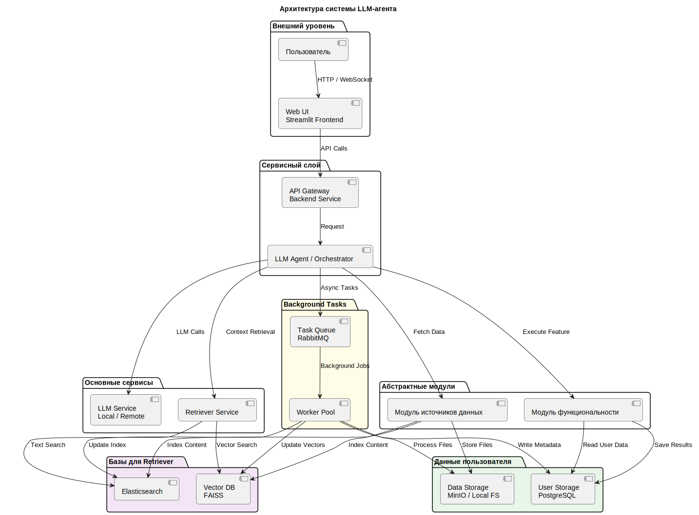

# Обзор системы

**Цель:** дать представление об устройстве системы.

Обзор архитектуры:
- диаграмма системы
- основные компоненты
- потоки данных. 
Отлично — добавлю выделение групп компонентов прямо в `01-overview.md`. Ниже — обновлённая версия файла с теми группами, оформленная готовым markdown'ом (включая mermaid-диаграмму). Можешь сразу вставить в `docs/01-overview.md`.

## Архитектура

## 🧠 Lifelong Learning Assistant

Сервис предоставляет интеллектуальные возможности (семантический поиск, генерация материалов, тестирование/симуляция интервью) на базе LLM, локальных источников и веб-поиска. Пользователь взаимодействует через Web UI (Streamlit); все «умные» операции оркеструет LLM Agent (Orchestrator). Данные индексируются в векторной БД и полнотекстовом индексе, а тяжёлые вычисления выполняются асинхронно через очередь и воркеры.

## Основные компоненты (сгруппированы)

### Компоненты Orchestration & Core

* **Web UI (Streamlit)** — единственная точка входа пользователя.
* **API Gateway / Backend** — аутентификация, быстрые CRUD-операции, маршрутизация запросов в Orchestrator; возвращает task-id для асинхронных операций.
* **LLM Agent / Orchestrator** — координация вызовов, формирование контекста, запуск инструментов (adapters, functional modules).
* **LLM Service (Connector)** — адаптер к локальным или облачным моделям.

### Databases for Retriever (Базы для Retriever)

* **Vector DB (FAISS)** — хранилище эмбеддингов для семантического поиска (быстрые similarity-запросы).
* **Elasticsearch** — полнотекстовый индекс для точного поиска по структурам (главы, заголовки, метаданные).

> Эти две базы работают совместно внутри Retriever: FAISS даёт семантику, ES — точность и структуру результатов.

### User Data (Данные пользователя)

* **User Storage (Postgres)** — пользователи, конфигурации, результаты квизов, метаданные карточек, интервалы spaced repetition.
* **Data Storage (MinIO / Local FS)** — сырые файлы: загруженные книги, web-snapshots, экспорты Obsidian, аудиозаписи.

> Эти хранилища содержат всё, что относится к данным пользователя и долговременному хранению.

### Background tasks (Фоновые задачи)

* **Task Queue (RabbitMQ / очередь)** — постановка длительных задач (парсинг, эмбеддинги, индексирование).
* **Worker Pool (Celery / воркеры)** — выполнение задач: парсинг, извлечение текста, генерация эмбеддингов, запись в FAISS/ES, обновление Postgres/FS.

> Асинхронная подсистема обеспечивает отзывчивость UI и масштабируемость тяжёлых операций.

### Data Sources & Adapters

* **Adapters / Source Module** — Obsidian, Books (fb2/epub), Telegram, Tavily (web), Context7 (docs) и т.п. Адаптеры собирают/фильтруют сырой контент и либо индексируют его, либо отдают Orchestrator для разовой обработки.

### Functional Modules

* **Quiz Engine**, **Interview Simulator** и другие бизнес-инструменты, которые используют Retriever + LLM для логики и сохраняют результаты в User Storage.

## Ключевые потоки данных (упрощённо)

1. **Интерактивный пользовательский запрос**
   UI → API → Orchestrator → (Retriever → FAISS/ES) + (LLM) → ответ пользователю (и/или создание background task).

2. **Добавление/обновление источника (книга, Obsidian, web snapshot)**
   Adapter → Data Storage (FS/MinIO) → MQ → Worker → (Embedding Service → Vector DB) + (Indexing → Elasticsearch) + запись метаданных в Postgres.

3. **Асинхронная обработка**
   Orchestrator ставит задачи в Task Queue; Worker Pool выполняет парсинг, эмбеддинг, индексацию и обновляет хранилища.

## Почему сгруппировали компоненты так

* **Логическая ясность** — группы отражают основные роли: оркестрация, хранение данных для поиска, хранение пользовательских данных, и фоновые обработчики. Это упрощает навигацию в docs и помогает быстро найти ответ на вопрос «где хранится/где обрабатывается X».
* **Понятие владельцев/ответственности** — группы легко привязываются к командам: infra (DB/Storage), ml/search (Retriever/FAISS/ES), backend (API/Orchestrator), ops (MQ/Workers).
* **Проектирование SLAs и масштабирования** — разные группы имеют разные требования (например, FAISS и воркеры — горизонтальное масштабирование; Postgres — stateful и backup-first).

## Где дальше смотреть (ссылки в docs)

* Быстрый старт: `02-getting-started.md`
* Архитектура & sequence diagrams: `03-architecture.md`
* Component Cards: `components/index.md`
* Deep Dive: `components/deep/`
* ADR (решения архитектуры): `04-adr/`
* Changelog: `05-changelog.md`
