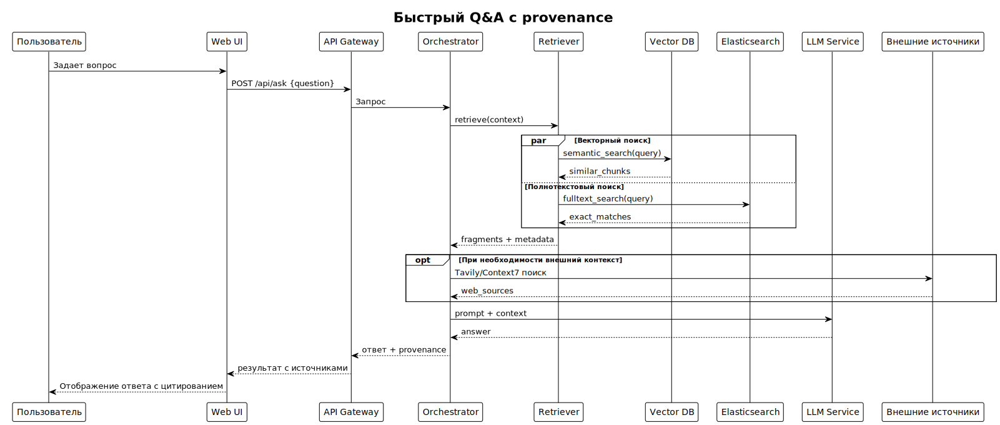
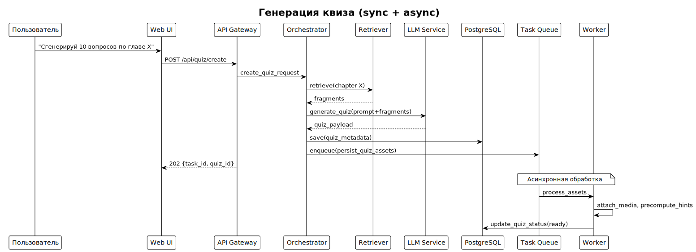

# Архитектура & Design

**Проект:** Lifelong Learning Assistant for Deep Learning  
**Цель:** зафиксировать ключевые архитектурные концепты, потоки данных, решения по масштабированию и интеграции компонентов.

## 📋 Содержание

1. [Ключевые архитектурные принципы](#1-ключевые-архитектурные-принципы)
2. [Sequence diagrams - типовые сценарии](#2-sequence-diagrams---типовые-сценарии)
3. [Асинхронные pipeline'ы](#3-асинхронные-pipelineы)
4. [Индексный pipeline](#4-индексный-pipeline)
5. [Ссылки на карточки компонентов](#5-ссылки-на-карточки-компонентов)
6. Идеи от LLM на будущее
   - [Масштабирование и отказоустойчивость](#6-масштабирование-и-отказоустойчивость)
   - [Точки расширения](#7-точки-расширения)
   - [API контракты](#8-api-контракты)
   - [Observability и мониторинг](#9-observability-и-мониторинг)
   - [Безопасность и политика данных](#10-безопасность-и-политика-данных)


---

## 1. Ключевые архитектурные принципы

> **Важно:** Данный документ дополняет [`01-overview.md`](01-overview.md) архитектурными деталями и техническими решениями.

### Ключевые концепции

Система построена на принципах **модульности** и **расширяемости**:
- Каждый компонент имеет четко определенную ответственность
- Компоненты взаимодействуют через стандартизированные интерфейсы
- Новый функционал добавляется через плагинную архитектуру

### 1.1 Основные принципы

| Принцип | Описание | Применение |
|---------|----------|------------|
| **Единая точка входа** | Пользователь взаимодействует только через Web UI (Streamlit) | Упрощение UX, централизованная аутентификация |
| **Модульность через контракты** | Компоненты интегрируются через четкие API-контракты | Заменяемость компонентов, независимая разработка |
| **Разделение ответственности** | Orchestration (API + Agent)<br> Retrieval (VDB + ES)<br> Source Module (Obsidian, Tavily, ...)<br> Functional Modules (Quiz Engine, Interview Simulator, ...)<br> Processing (Workers)<br> Storage | специализация компонентов, легкое расширение, плагины |
| **Гибридный поиск** | Комбинация векторного и полнотекстового (Elasticsearch) поиска | Точность и семантическое понимание |
| **Provenance-first** | Каждый ответ содержит трассировку источников | Прозрачность, проверяемость ответов |

### 1.2 Принципы расширяемости

- **Плагинная архитектура Orchestrator** — инструменты добавляются как `run(context)` модули
- **Абстракция источников** — единый интерфейс для всех Source Module (Obsidian, Books, Telegram и др.)
- **Абстракция функционала** — единый интерфейс для всех Functional Modules (Quiz Engine, Interview Simulator и др.)
- **Легкое переключение LLM** — адаптер позволяет переключаться между локальными и облачными моделями
- **Конфигурируемое хранение** — возможность замены FAISS → Qdrant, MinIO → S3 без изменения логики

---

## 2. Sequence diagrams - типовые сценарии

### 2.1 Быстрый Q&A с provenance



*Диаграмма последовательности: Быстрый Q&A с provenance*

### 2.2 Генерация квиза (sync + async)



*Диаграмма последовательности: Генерация квиза (sync + async)*

### 2.3 Загрузка и обработка книги


*Диаграмма последовательности: Загрузка и обработка книги*

### 2.4 Telegram ingest (background)


*Диаграмма последовательности: Telegram ingest (background)*

### 2.5 Веб-поиск через Tavily (одноразовый контекст)


*Диаграмма последовательности: Веб-поиск через Tavily (одноразовый контекст)*

---

## 3. Асинхронные pipeline'ы

### 3.1 Архитектура асинхронности

| Компонент | Технология | Назначение |
|-----------|------------|------------|
| **Task Queue** | RabbitMQ | Брокер сообщений с поддержкой приоритетов и idempotency |
| **Worker Pool** | Celery | Масштабируемые воркеры для разных типов задач |

### 3.2 Типы задач

#### IO-bound задачи
- Парсинг файлов (fb2, epub, markdown)
- Загрузка и обработка веб-контента
- Синхронизация с внешними API

#### CPU-bound задачи
- Генерация эмбеддингов
- Обработка и анализ текста
- Генерация квизов и карточек

### 3.3 Обработка ошибок

- **Visibility timeout + retries** с exponential backoff
- **Dead-letter queue** для ручного разбора проблемных задач
- **Idempotent операции** для безопасного повторного выполнения
- **Circuit breakers** для внешних вызовов

## 4. Индексный pipeline

### 4.1 Детальный flow обработки данных


*Flowchart: Детальный flow обработки данных*

### 4.2 Стратегии chunking

| Источник | Размер chunk | Overlap | Стратегия |
|----------|--------------|---------|-----------|
| **Книги** | 1024 токена | 20% | По главам/параграфам |
| **Obsidian** | 512 токенов | 15% | По заметкам |
| **Telegram** | 256 токенов | 10% | По сообщениям |
| **Web** | 768 токенов | 25% | По смысловым блокам |

### 4.3 Provenance tracking

Для каждого чанка сохраняется:
- `file_path` или `source_url`
- `chapter` или `thread_id`
- `offset` в исходном документе
- `source_id` и `timestamp`
- `content_hash` для deduplication

## 5. Ссылки на карточки компонентов

Для детального изучения компонентов системы обращайтесь к специализированной документации ([ссылка](./components/index.md)).

### 5.1 Architecture Decision Records (ADR)

| Решение | Документ | Статус |
|---------|----------|--------|
| Выбор векторной БД (FAISS vs Qdrant) | [`04-adr/0001-vector-db-choice.md`](04-adr/0001-vector-db-choice.md) | 📋 Планируется |
| Выбор брокера сообщений (RabbitMQ vs Redis) | [`04-adr/0002-async-broker-choice.md`](04-adr/0002-async-broker-choice.md) | 📋 Планируется |
| Локальные vs облачные LLM | [`04-adr/0003-local-vs-cloud-llm.md`](04-adr/0003-local-vs-cloud-llm.md) | 📋 Планируется |

### 5.2 Диаграммы и схемы

| Диаграмма | Формат | Файл | Назначение |
|-----------|--------|------|------------|
| **System Components** | PlantUML | [`diagrams-src/03-architecture/system-components.puml`](diagrams_src/03-architecture/system-components.puml) | 📋 Планируется |
| **Quick Q&A Flow** | Mermaid | [`diagrams_src/03-architecture/quick-qa-sequence.mmd`](diagrams_src/03-architecture/quick-qa-sequence.mmd) | 📋 Планируется |
| **Book Ingest Process** | Mermaid | [`diagrams_src/03-architecture/book-ingest-flow.mmd`](diagrams_src/03-architecture/book-ingest-flow.mmd) | 📋 Планируется |
| **Async Pipelines** | Mermaid | [`diagrams_src/03-architecture/async-pipelines.mmd`](diagrams_src/03-architecture/async-pipelines.mmd) | 📋 Планируется |

---

## 6. Масштабирование и отказоустойчивость

### 6.1 Стратегии масштабирования

| Компонент | Стратегия | Ограничения | SLA Target |
|-----------|-----------|-------------|------------|
| **API Gateway** | Горизонтальное (load balancer) | Stateless архитектура | p99 ≤ 100ms |
| **Orchestrator** | Stateless → горизонтальное | LLM latency зависимость | p99 ≤ 500ms + LLM |
| **LLM Service** | Очередь запросов + rate limiting | Локальные модели: GPU/CPU | p99 ≤ 2s (локальная) |
| **Vector DB** | FAISS → Qdrant (при росте) | Индекс в памяти | p99 ≤ 100ms |
| **Elasticsearch** | Sharding + replication | Heap size ограничения | p99 ≤ 200ms |
| **Workers** | Динамическое по queue depth | Время задач vs SLA | 95% задач ≤ 10 мин |

### 6.2 Отказоустойчивость

#### Graceful degradation
- **Внешние источники недоступны** → система использует только локальные индексы
- **LLM недоступен** → fallback к упрощенному поиску без генерации
- **Vector DB недоступен** → только полнотекстовый поиск

#### Circuit breakers
- **Tavily API**: 5 ошибок подряд → пауза 60 сек
- **LLM сервисы**: 3 таймаута → переключение на резервную модель
- **Внешние БД**: connection timeout → повтор с exponential backoff

#### Резервное копирование
- **PostgreSQL**: ежедневные бэкапы + WAL архивирование
- **FAISS**: еженедельные снапшоты индексов
- **MinIO**: репликация данных между узлами
- **Elasticsearch**: snapshots в S3/MinIO

---

## 7. Точки расширения

### 7.1 Добавление нового источника данных

(написать)

### 7.2 Добавление функционального модуля

(написать)

### 7.3 Добавление новой LLM модели

(написать)

## 8. API контракты

### 8.1 Authentication

```http
POST /api/auth/login
Content-Type: application/json

{
  "username": "user@example.com",
  "password": "secure_password"
}

Response 200:
{
  "access_token": "jwt_token_here",
  "token_type": "bearer",
  "expires_in": 3600
}
```

### 8.2 Q&A Endpoints

```http
# Быстрый Q&A
POST /api/ask
Authorization: Bearer {token}
Content-Type: application/json

{
  "question": "Что такое attention mechanism?",
  "sources": ["obsidian", "yandex_handbook"],
  "max_context": 5,
  "include_provenance": true
}

Response 200:
{
  "answer": "Attention mechanism - это...",
  "sources": [
    {
      "source_id": "obsidian_note_123",
      "snippet": "Attention позволяет моделям...",
      "confidence": 0.95,
      "file_path": "/vault/notes/attention.md"
    }
  ],
  "latency_ms": 850
}

# Асинхронный сложный запрос
POST /api/ask/async
Authorization: Bearer {token}
Content-Type: application/json

{
  "question": "Сравни подходы к fine-tuning BERT и GPT",
  "require_web_verification": true,
  "sources": ["all"],
  "depth": "comprehensive"
}

Response 202:
{
  "task_id": "task_abc123",
  "estimated_duration": "2-5 minutes",
  "web_search_enabled": true
}
```

### 8.3 Quiz Management

```http
# Создание квиза
POST /api/quiz/create
Authorization: Bearer {token}
Content-Type: application/json

{
  "chapter_id": "yandex_ml_chapter_4",
  "n_questions": 10,
  "difficulty": "intermediate",
  "question_types": ["multiple_choice", "open_ended"],
  "adaptive": true
}

Response 202:
{
  "task_id": "quiz_gen_789",
  "quiz_id": "quiz_def456",
  "status": "generating",
  "estimated_completion": "2025-11-02T15:41:00Z"
}

# Получение квиза
GET /api/quiz/{quiz_id}
Authorization: Bearer {token}

Response 200:
{
  "quiz_id": "quiz_def456",
  "status": "ready",
  "questions": [
    {
      "id": "q1",
      "type": "multiple_choice",
      "question": "Что измеряет precision?",
      "options": ["TP/(TP+FP)", "TP/(TP+FN)", "TP/(TP+FP+FN)"],
      "correct_answer": 0
    }
  ],
  "metadata": {
    "source_chapter": "Метрики классификации",
    "difficulty": "intermediate",
    "created_at": "2025-11-02T15:40:00Z"
  }
}
```

### 8.4 Book Upload

```http
# Загрузка книги
POST /api/book/upload
Authorization: Bearer {token}
Content-Type: multipart/form-data

file: [binary data]
metadata: {
  "title": "Deep Learning",
  "author": "Ian Goodfellow",
  "language": "en",
  "format": "fb2"
}

Response 202:
{
  "task_id": "book_process_xyz789",
  "file_id": "file_abc123",
  "status": "uploaded",
  "estimated_processing_time": "5-10 minutes"
}

# Статус обработки
GET /api/book/{file_id}/status
Authorization: Bearer {token}

Response 200:
{
  "file_id": "file_abc123",
  "status": "processing", # uploaded|processing|ready|error
  "progress": 65,
  "chunks_processed": 1247,
  "chunks_total": 1923,
  "current_step": "Generating embeddings",
  "eta_seconds": 180
}
```

### 8.5 Source Management

```http
# Синхронизация Obsidian
POST /api/obsidian/sync
Authorization: Bearer {token}
Content-Type: application/json

{
  "vault_path": "/path/to/vault",
  "incremental": true,
  "include_attachments": false
}

Response 202:
{
  "task_id": "obsidian_sync_456",
  "status": "started",
  "estimated_duration": "2-5 minutes"
}

# Управление Telegram каналами
GET /api/telegram/channels
Authorization: Bearer {token}

Response 200:
{
  "channels": [
    {
      "id": "@dl_weekly",
      "name": "DL Weekly",
      "last_sync": "2025-11-02T10:00:00Z",
      "messages_processed": 1247,
      "status": "active"
    }
  ]
}

POST /api/telegram/channels
Authorization: Bearer {token}
Content-Type: application/json

{
  "channel_id": "@new_research",
  "name": "New Research Papers",
  "keywords": ["transformer", "attention", "bert"],
  "min_relevance_score": 0.7
}

Response 201:
{
  "channel_id": "@new_research",
  "status": "added",
  "first_sync_scheduled": "2025-11-02T16:00:00Z"
}
```

---

## 9. Observability и мониторинг

### 9.1 Ключевые метрики

#### API метрики
- **Latency**: p50, p95, p99 для каждого эндпоинта
- **Error rate**: 4xx, 5xx ошибки по типам
- **Throughput**: запросы в секунду
- **Active connections**: текущие подключения

#### Queue метрики
- **Queue depth**: количество задач в очереди
- **Task processing time**: время обработки по типам задач
- **Retry rate**: процент повторных попыток
- **Dead letter count**: задачи в DLQ

#### LLM метрики
- **Token usage**: токены в минуту/час
- **Response time**: время ответа модели
- **Success rate**: процент успешных запросов
- **Cost per request**: для облачных моделей

#### Storage метрики
- **Index size**: размер векторного индекса
- **Query performance**: время поиска в VDB/ES
- **Storage usage**: использование дискового пространства
- **Index freshness**: актуальность индексов

### 9.2 Логирование

#### Структура лога
```json
{
  "timestamp": "2025-11-02T15:36:21.439Z",
  "level": "INFO",
  "trace_id": "req_abc123_trace_xyz789",
  "span_id": "span_456",
  "component": "orchestrator",
  "event": "qa_request_processed",
  "user_id": "user_123",
  "request_id": "req_abc123",
  "duration_ms": 850,
  "sources_used": ["obsidian", "yandex_handbook"],
  "llm_model": "llama2:7b",
  "tokens_consumed": 1247,
  "response_length": 567
}
```

#### Алерты
- **High latency**: p99 > 2s на Q&A эндпоинтах
- **Queue overflow**: глубина очереди > 1000 задач
- **High error rate**: >5% ошибок за 5 минут
- **Storage issues**: диск заполнен > 80%
- **LLM service down**: недоступность > 30 секунд

### 9.3 Runbooks

#### Очередь переполнена
1. Проверить количество активных воркеров
2. Увеличить количество воркеров при необходимости
3. Просмотреть DLQ на предмет проблемных задач
4. При необходимости очистить старую очередь

#### Vector DB коррупция
1. Использовать последний snapshot для восстановления
2. Пересчитать недостающие эмбеддинги
3. Проверить консистентность индексов
4. Перезапустить сервис

#### LLM таймауты
1. Проверить статус LLM сервиса
2. Переключиться на fallback модель
3. Активировать degraded mode (только локальные источники)
4. Восстановить полный функционал после устранения проблемы

---

## 10. Безопасность и политика данных

### 10.1 Принципы безопасности

- **Zero Trust**: проверка каждого запроса
- **Минимальные привилегии**: доступ только к необходимым ресурсам
- **Локальное хранение по умолчанию**: данные не покидают систему
- **End-to-end encryption**: шифрование на всех уровнях

### 10.2 Аутентификация и авторизация

```python
# Роли и разрешения
ROLES = {
    "user": ["read_own_data", "ask_questions", "create_quizzes"],
    "admin": ["user_permissions"] + USER_ROLES + ["system_config"],
    "service": ["read_all_data", "write_logs"]
}

# JWT токены с коротким временем жизни
ACCESS_TOKEN_EXPIRE_MINUTES = 60
REFRESH_TOKEN_EXPIRE_DAYS = 30
```

### 10.3 Шифрование

| Уровень | Алгоритм | Технология | Ключи |
|---------|----------|------------|--------|
| **At-rest** | AES-256 | PostgreSQL, MinIO, FAISS | HashiCorp Vault |
| **In-transit** | TLS 1.3 | Все API вызовы | Let's Encrypt |
| **Application** | bcrypt/Argon2 | Пароли пользователей | Salt + pepper |

### 10.4 Политика хранения данных

#### PII защита
- **Автоматическое обнаружение**: регулярные сканы на PII
- **Избирательное индексирование**: PII не попадает в поисковые индексы
- **Retention policy**: автоматическое удаление устаревших данных

#### Пользовательские настройки
```yaml
data_retention:
  web_snapshots: 30 days    # по умолчанию
  uploaded_books: 1 year    # по умолчанию
  telegram_messages: 90 days # по умолчанию
  conversation_history: 6 months # по умолчанию

privacy_settings:
  share_usage_analytics: false
  allow_external_llm: false
  encrypt_local_storage: true
```

### 10.5 Аудит и соответствие

- **Все операции с данными** логируются с trace_id
- **Доступ к PII** требует специальных разрешений
- **Экспорт данных** пользователем в JSON формате
- **Право на удаление** всех пользовательских данных

---

*Документ обновлен: 2025-11-02*  
*Версия: 2.0*  
*Статус: Готов к использованию*
