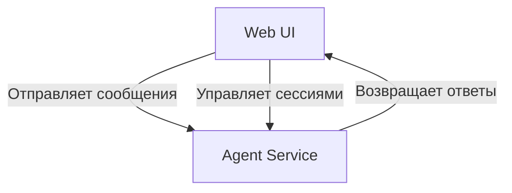
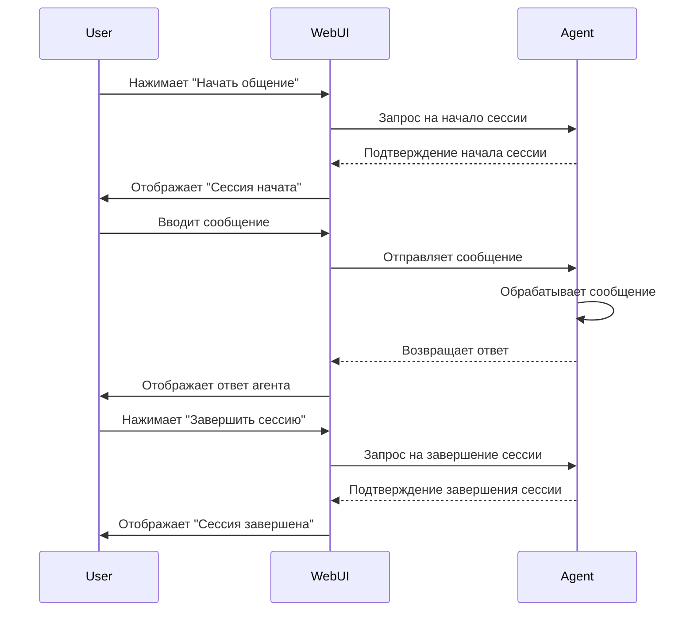

# Документация Web UI

## Обзор

Web UI предоставляет интерфейс для взаимодействия пользователей с агентом ЛЛМ. Он позволяет начинать сессии общения, отправлять сообщения и получать ответы от агента.

## Архитектура

### Компоненты системы



### Взаимодействие компонентов



## Принципы работы

### Начало сессии

1. Пользователь нажимает кнопку "Начать общение" в интерфейсе Web UI.
2. Web UI устанавливает флаг `session_active` в значение `True`.
3. В интерфейсе отображается сообщение "Сессия начата. Вы можете отправлять сообщения агенту."

### Отправка сообщений

1. Пользователь вводит сообщение в поле ввода и нажимает "Отправить".
2. Web UI проверяет, активна ли сессия (`session_active`).
3. Если сессия активна, сообщение отправляется на эндпоинт агента `/api/agent/run`.
4. Агент обрабатывает сообщение и возвращает ответ.
5. Web UI отображает ответ агента в чате.

### Завершение сессии

1. Пользователь нажимает кнопку "Завершить сессию".
2. Web UI устанавливает флаг `session_active` в значение `False`.
3. Web UI отправляет запрос на завершение сессии на эндпоинт агента `/api/agent/end_session`.
4. В интерфейсе отображается сообщение "Сессия завершена."

## Конфигурация

### Порты

- **Web UI**: 8150
- **Agent Service**: 8250

### Docker сети

Web UI подключен к следующим сетям:

- `rag_network`
- `test_generator_network`

### Переменные окружения

- `AGENT_SERVICE_URL`: URL агента (по умолчанию: `http://localhost:8250`)

## Запуск и использование

### Запуск Web UI

```bash
cd web_ui_service
uv run python web_ui.py
```

### Запуск Agent Service

```bash
cd agent_service
uv run python app.py
```

### Использование

1. Откройте браузер и перейдите по адресу `http://localhost:8150`.
2. Нажмите кнопку "Начать общение", чтобы начать сессию.
3. Введите сообщение в поле ввода и нажмите "Отправить".
4. Просмотрите ответ агента в чате.
5. Нажмите "Завершить сессию", чтобы завершить общение.

## Ссылки на код

- [Web UI код](web_ui_service/web_ui.py)
- [API эндпоинты](web_ui_service/api_endpoints.py)
- [Agent Service код](agent_service/app.py)
- [Docker конфигурация Web UI](web_ui_service/docker-compose.yml)
- [Docker конфигурация Agent Service](agent_service/docker-compose.yml)